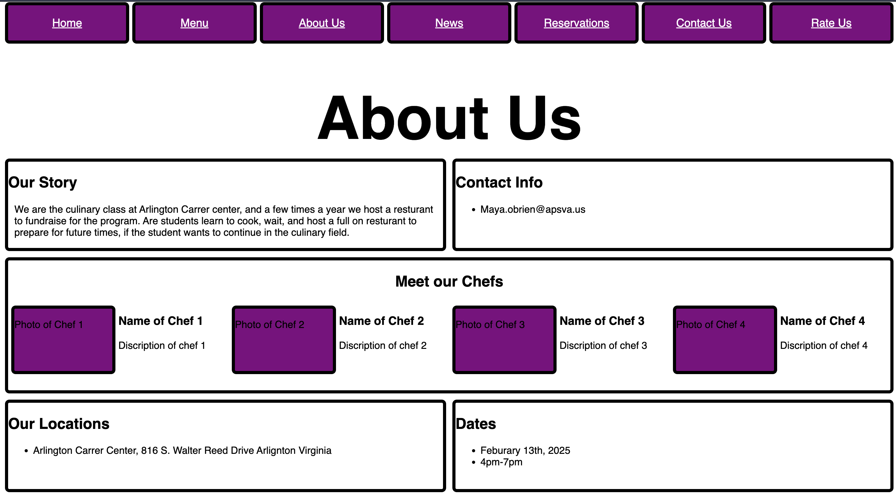
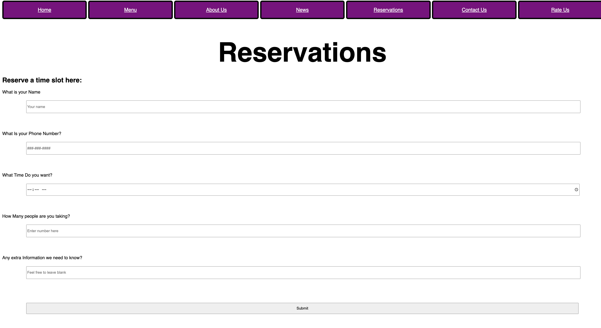

# Off The Pike

For this project me and my team worked on a Off The Pike Web page design. I worked on the About Us page, and the reservations page. Throughout this project I had to learn how to use the git pull and git merge commands, and this helped me to learn how to use guthub better. Throughout this project I only had one merge conflict, thankfully, and I learned how to deal with them. This project was a good learning chance on how to work tegether when coding.

(This page has been zoomed out to fit all things on the page in it)

[Our Repo](https://github.com/NotABotDaniel/OffThePike)
